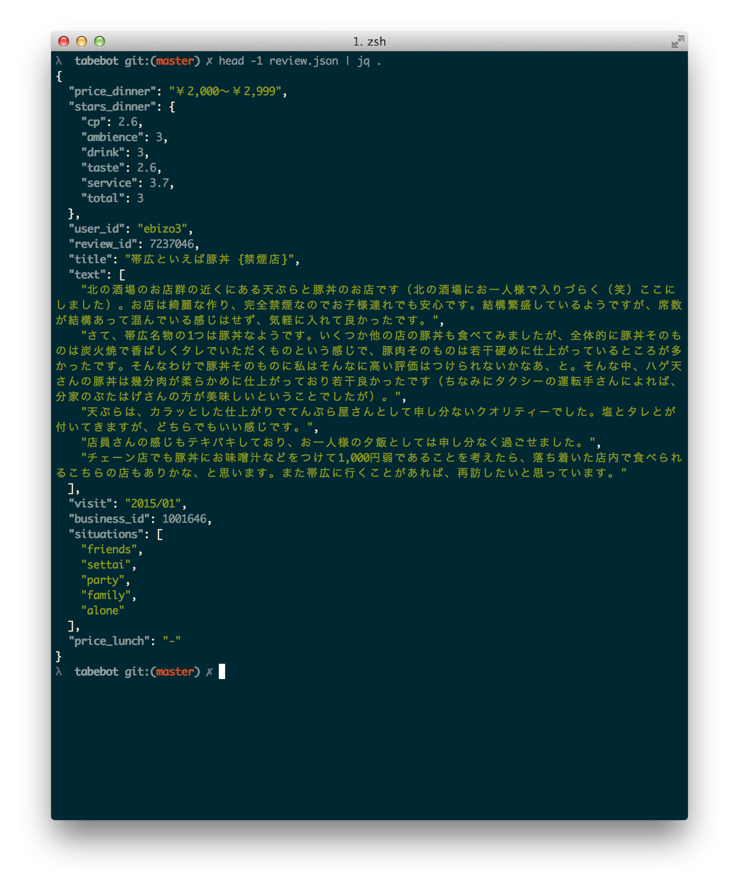
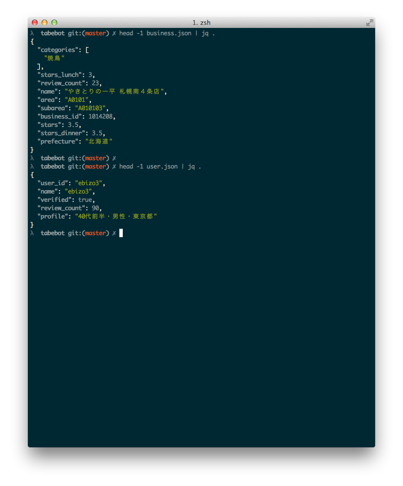

# tabebot

A minimal crawler for [tabelog](http://tabelog.com/), written on top of [Scrapy](http://scrapy.org/)

## Quick Usage

```bash
git clone https://github.com/mrorii/tabebot.git && cd tabebot
pip install -r requirements.txt
# Modify `USER_AGENT` in tabebot/settings.py

scrapy crawl tabebot
```

This will start writing out scraped results to:

* `business.json`
* `review.json`
* `user.json`

in the working directory.

Crawl responsibly.

## Screenshot

Example output:




